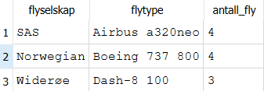

# Databaser prosjekt del 2
## Kjøring av programmet
Skriv inn i konsollen:
`$ python3 main.py` for å bygge databasen og fylle den med data.
`$ python3 brukstilfelle_6.py` for å kjøre pythonprogrammet for brukstilfelle 6.
`$ python3 brukstilfelle_8.py` for å kjøre pythonprogrammet for brukstilfelle 8.

## Kommentarer
Vi har funnet ut at databasestrukturen vår ikke var helt optimal når det gjelder å lage flyruter. På grunn av at vi lagret Delrute som en svak klasse måtte vi lagre veldig lik data flere ganger i tabellen. For flyruter som inneholder mellomlandinger må man lagre delruten (mellom 2 flyplasser) på nytt for hver permutasjon av den hele flyruten. Skulle vi laget databasen på nytt senere hadde vi ikke valgt å gjøre Delrute til en svak klasse, for å kunne lagre data til flere flyruter.

## Output fra spørringen i brukstilfelle 5

